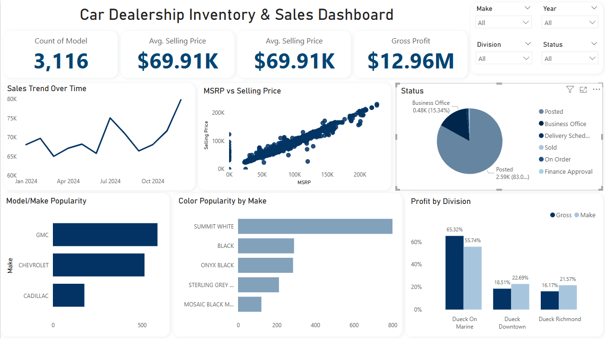

# 🚗 Car Dealership Inventory & Sales Dashboard

This project provides a **Power BI dashboard** for analyzing car dealership performance, including **inventory management, sales trends, and profitability**. Dealerships often face challenges in understanding which models sell best, how pricing compares to MSRP, and how different divisions perform. This dashboard consolidates key metrics into a single interactive view, enabling stakeholders to monitor **inventory levels, gross profit, selling price trends, and vehicle popularity**. With these insights, dealerships can make **data-driven decisions** on pricing strategies, marketing efforts, and stocking plans.

---

## 📊 Key Features
- **KPIs at a glance** – Total Vehicles, Avg. Selling Price, Gross Profit, % Posted Status  
- **Sales Trend Over Time** – Line chart to track performance across years  
- **MSRP vs Selling Price** – Scatter plot to evaluate pricing strategy  
- **Model & Make Popularity** – Identify top-performing brands and models  
- **Color Popularity** – Insights into customer preferences  
- **Division-wise Breakdown** – Compare performance across dealership locations  

---

## 🚀 Summary Insights
📦 **3,116 Vehicles** in inventory  
💰 **$12.96M Total Gross**  
📈 **$69.91K Avg. Selling Price**  
📝 **83.02% Posted Status**  

➡️ **Summary Insight Box:**  
**“🚀 Sales up 15% YoY, GMC most popular, Avg Days-to-Sell down by 12%”**

---

## 🛠️ Tech Stack
- **Power BI Desktop** – Dashboard development  
- **Excel / CSV** – Data source (`INVENTORY.xlsx`)  
- **DAX & Power Query** – Data transformations and calculations  
- **Visualization Techniques** – KPI cards, trend analysis, scatter plots, bar charts, pie charts  

---

## 📸 Dashboard Preview

### Dashboard Screenshot

## 📑 Dashboard Report (PDF)

You can view the full interactive report as a PDF here:  
👉 [View Dashboard Report](dashboard.pdf)
